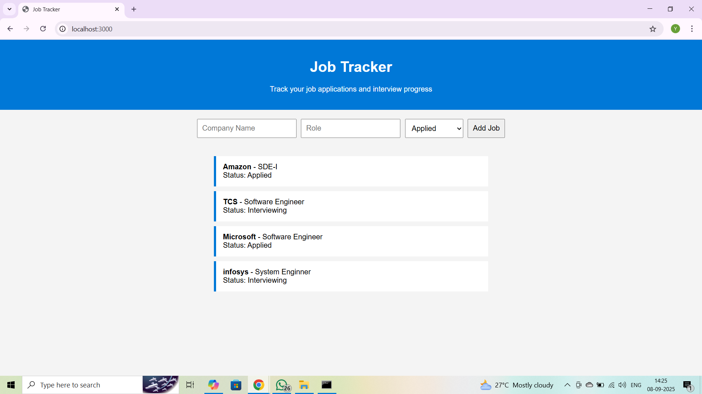

# Job Tracker Web App

A full-stack web application to track job applications and interview stages, developed during my **Virtual Web Development Internship at ExcelR**.

---

## Features
- Add job entries with status (Applied, Interviewing, etc.)
- View all applications in a dynamic list
- Responsive UI with backend integration

---

## Tech Stack
- Frontend: HTML, CSS, JavaScript
- Backend: Node.js + Express

---

## Screenshot



---

## Run Locally

1. Clone the repository:

```bash
git clone https://github.com/yourusername/JobTracker-App.git
cd JobTracker-App


## Run Locally
```bash
npm install
node server.js
Open your browser and go to:

http://localhost:3000
